# proxmox

My dell server booted with proxmox where I have some VMS. I created 3 VMs (the ones named pve1/2/3) and booted proxmox onto them.

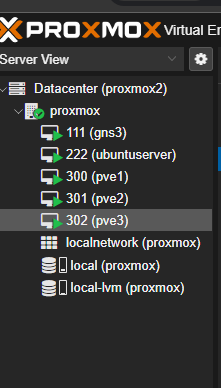

They gave a message, I believe this is because they're nested VMs and may not be as efficient as they could be if I had newer CPUs, but I bought this Dell on the cheap.

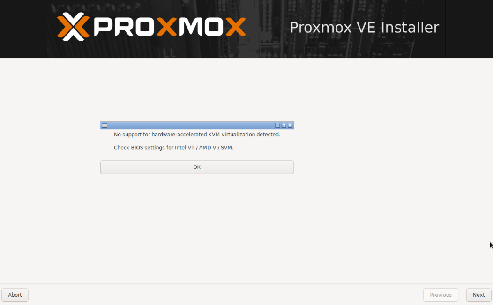

I created a cluster named "rick" because that's what my friends told me to name it and joined the pve's to it. 

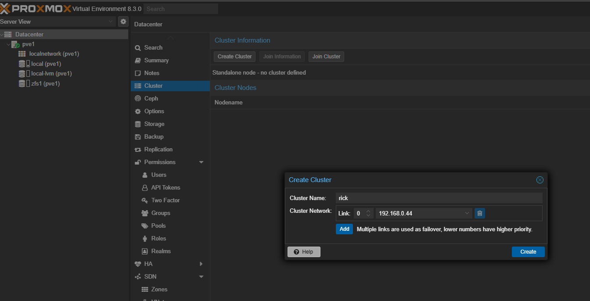

When I created the pve's I gave them all an additional disk, so I could configure ceph, distributed storage for better failovers/redundancy/replication.

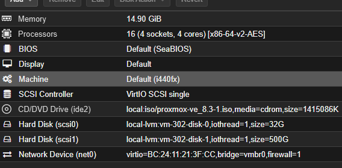

Then I started initializing ceph using a basic config for each. 

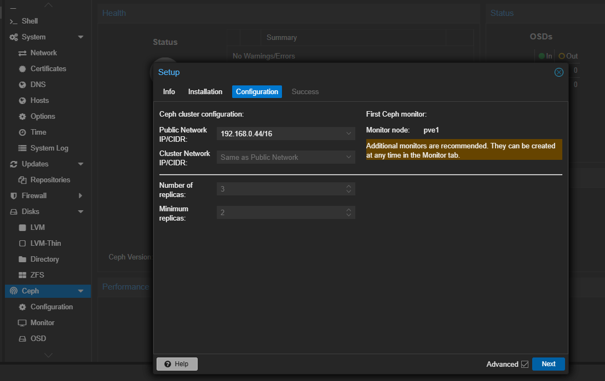

Created ceph pool "coolpool" for distributed storage and then created OSDs for each pve to form my distributed storage. 

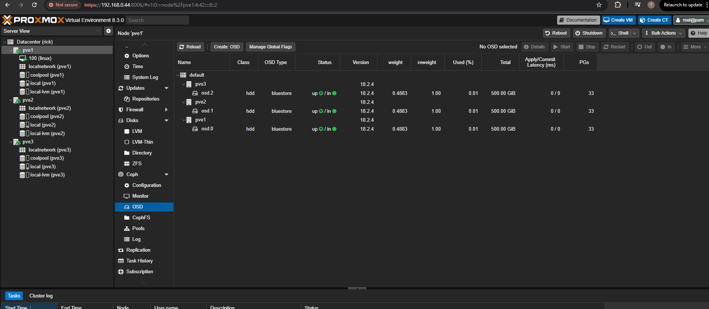

Created linux server in my ceph pool to test high availability failovers. 

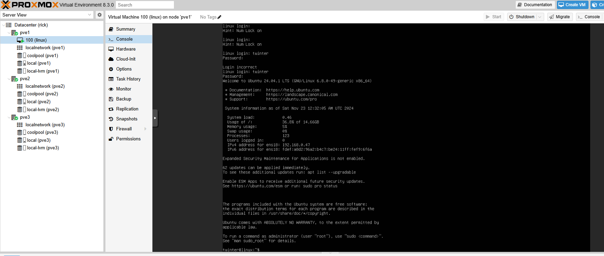

Have to finish configuring high availability on my datacenter (rick, btw). Groups allow you to specify where and how nodes failover, even split between nodes. Some nodes might be more fit to handle resources than others. For my purposes I configured a group called "snake-eyes" including all my nodes. I left nofailback unchecked, because I want my VM to failback to the original node when/if it comes back on. I gave pve1 the highest priority, I guess I consider it to my primary node.  

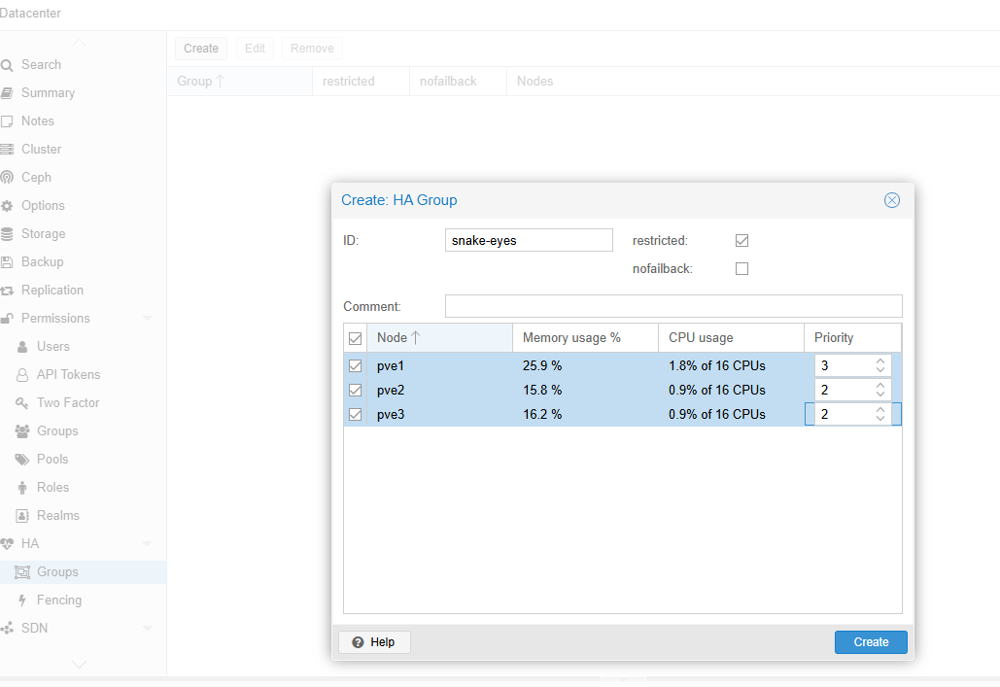

Add resources

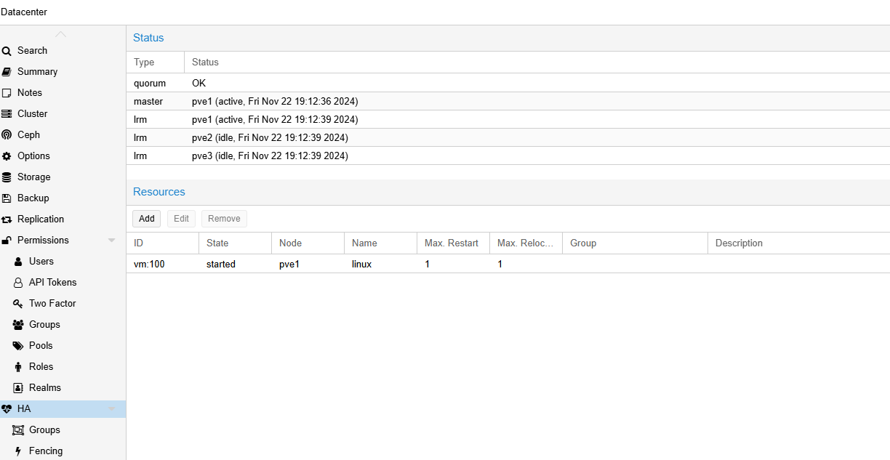

First I just tested a basic migration. I started a constant ping on my linux VM and then migrated the VM to pve2. The ping remained constant; however, the linux VM very quickly migrated back since I did not enable nofailbacks. This is definitely something to consider when doing storage or host maintenance.

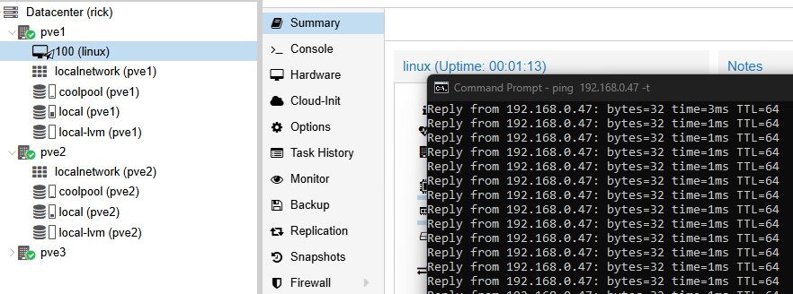

Now to test a node failure. For this I simply shut down the pve1 VM. 

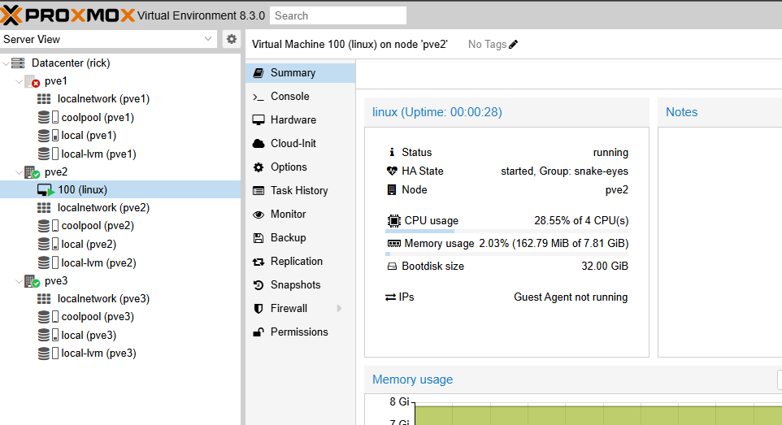

And back again. 

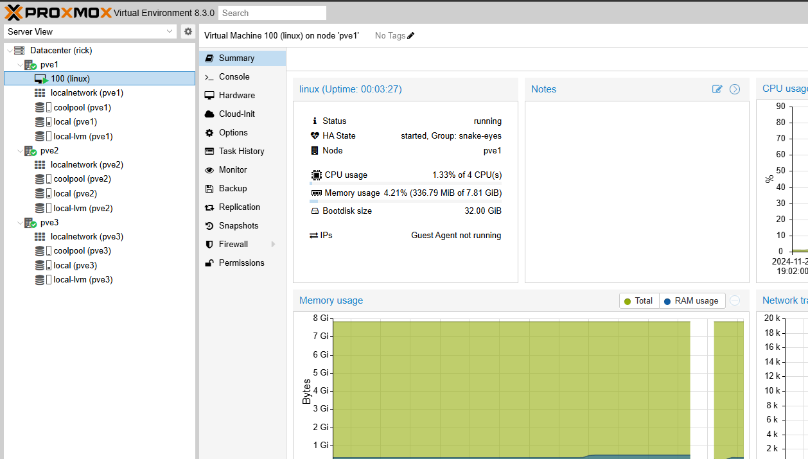

So with this we can maintain operations with no manual intervention in case of a severe fault. Of course the other big issue here is the potential for some application servers not using dns names and instead using IP addresses. This brings on the problem of having to reconfig several application servers, increasing downtime. A potential solution for this is implementing vxlan. 
